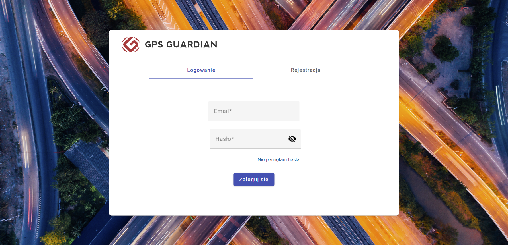
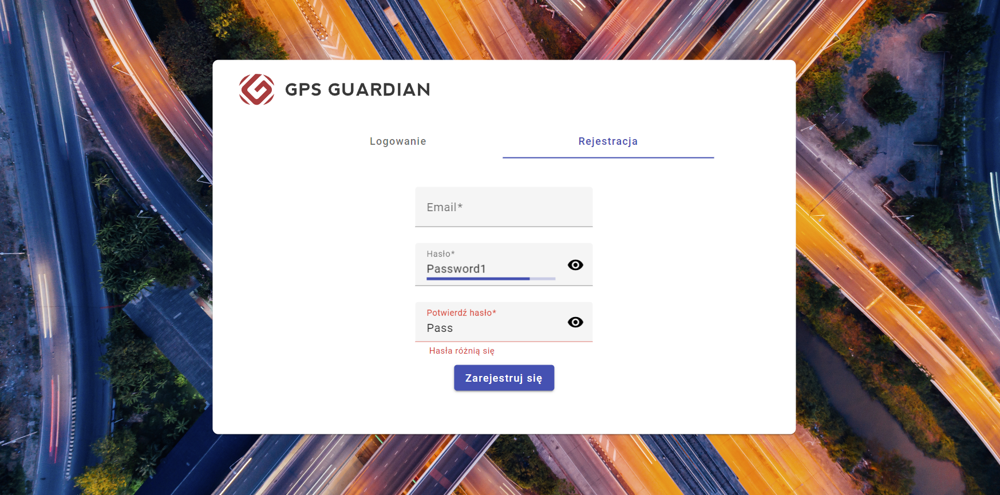
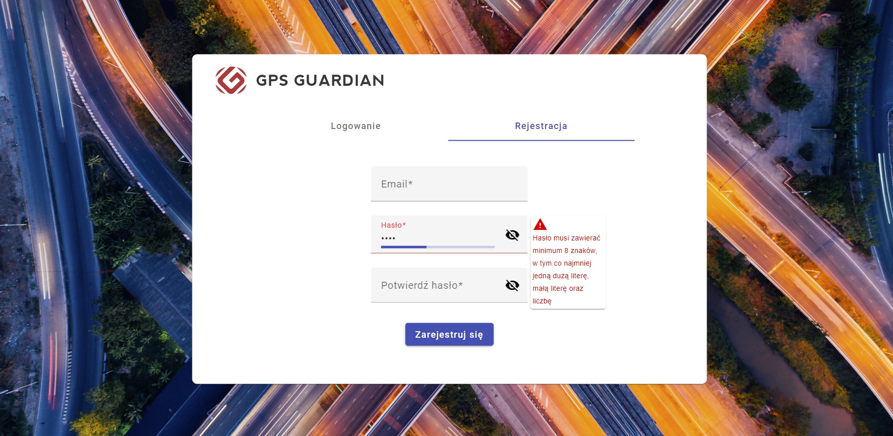

## Frontend:

Angularowa aplikacja z możliwością logowania, rejestracji oraz resetu hasła.

### Formularz logowania - widok główny:

### Formularz rejestracji wraz ze zmianą widoczności hasła oraz błędami:

